# Fastcampus Data Science Extension SCHOOL
## noSQL

---
<!--
page_number: true
$size: A4
footer : fastcampus 데이터 사이언스 Extension 스쿨, Wooyoung Choi, 2018
-->
## noSQL

- 확장가능성, 스키마 없는 데이터 모델에 유리
- Row, Document, key-value 등 다양

---
## RDBMS와 다른점
- Schemaless
- Join 불가능(reference 등으로 구현)
- No Transaction
- 수평확장 용이

---
## 종류
- {Key:Value} = Redis
- [Column] = Cassandra, HBase
- Document {Key:{Key:Value}} = CouchDB, MongoDB

---
## MongoDB
- BSON(Binary JSON) 기반 Key-Value Store
- JSON 형태 문서
- Collection -> Document -> Key:Value Data

---
### Requirements
- DB instance(mLab)
- pymongo(`$ pip install pymongo`)
- pandas(`$ pip install pandas`)
- requests(`$ pip install requests`)
- jupyter notebook(`$ pip install jupyter`)

---
### Sign up

---
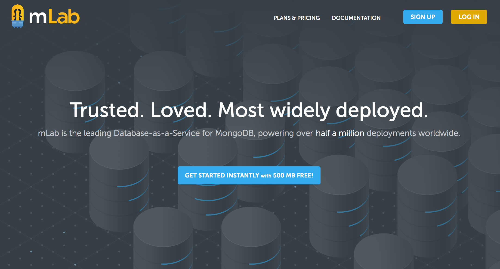

---
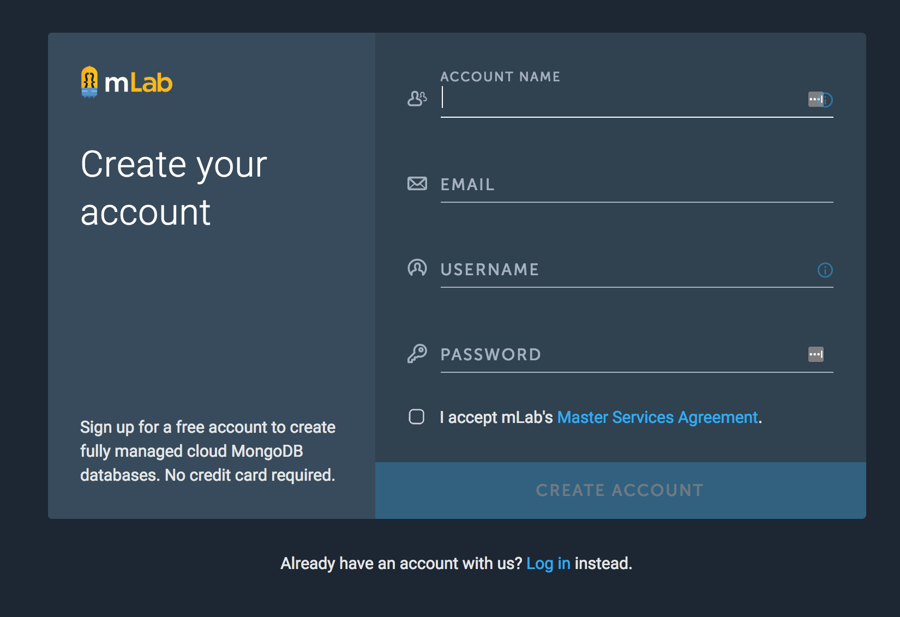

---
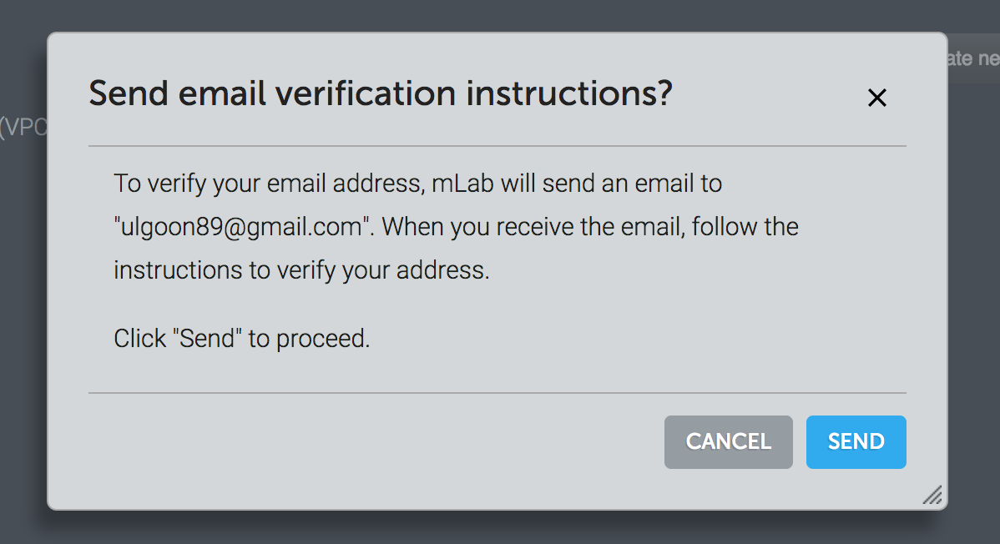

---
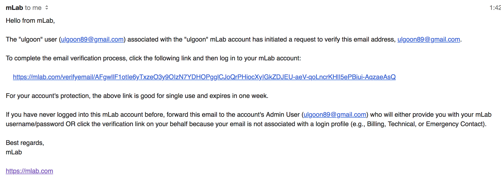

---
### Create New DB 

---
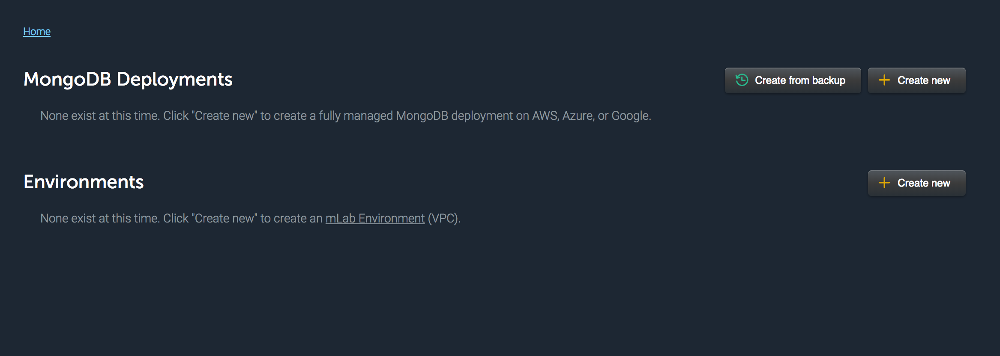

---
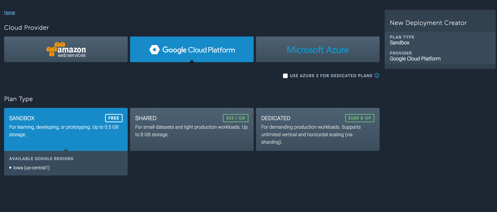

---
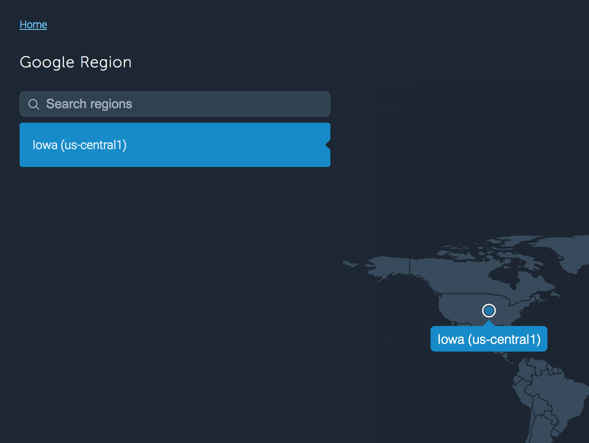

---


---
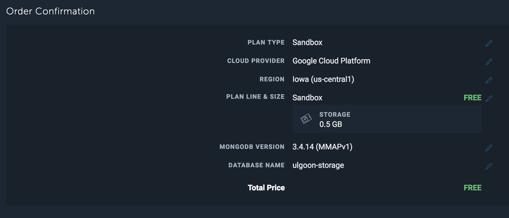

---
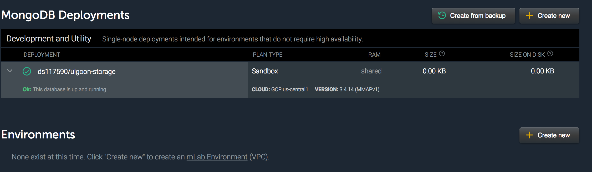

---
### Add New User

---


---
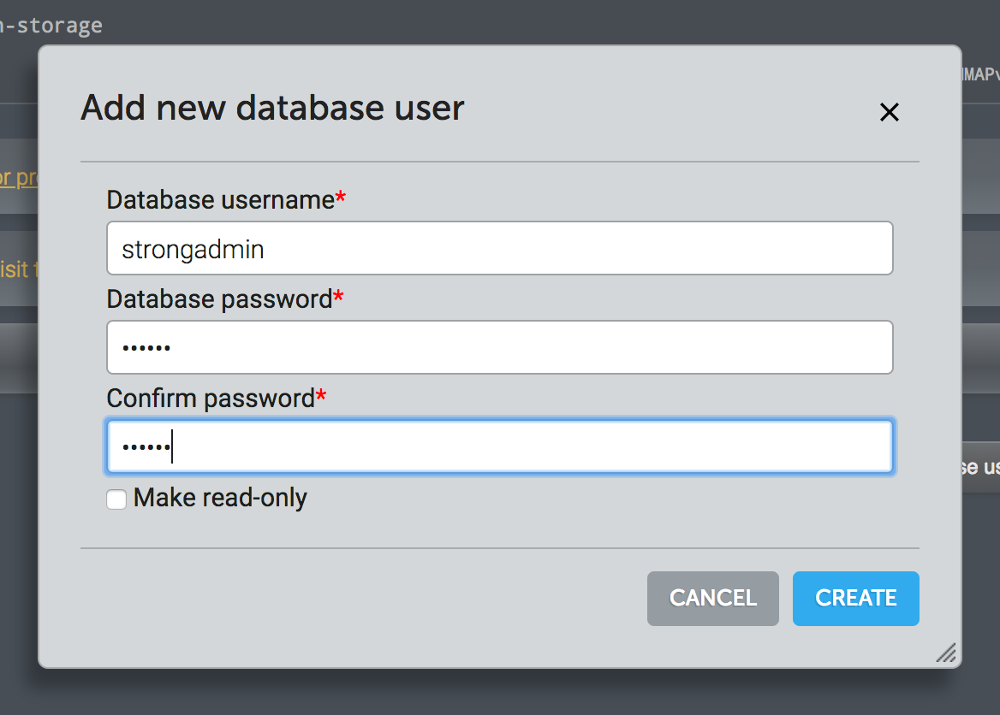

---
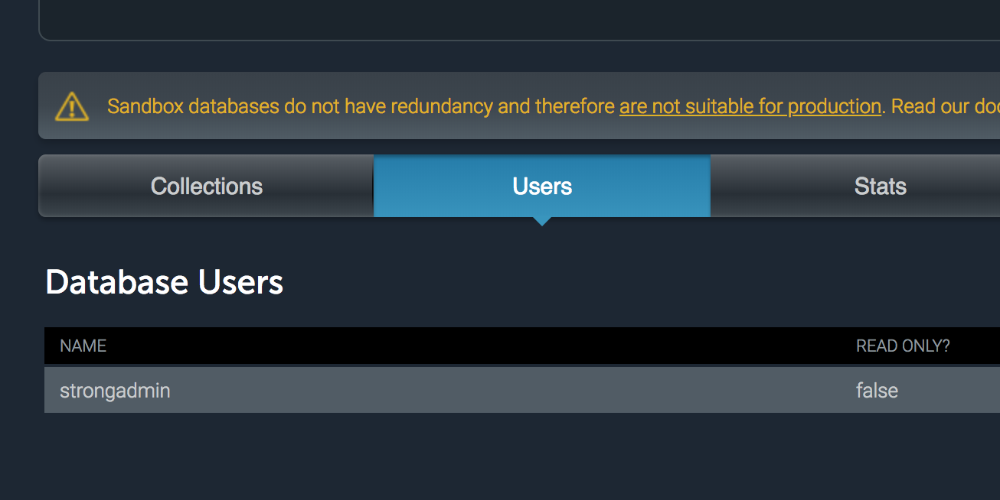

---
### How to connect to MongoDB

---
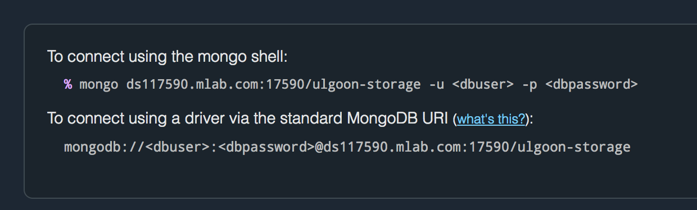

---
### Create New Collection

---
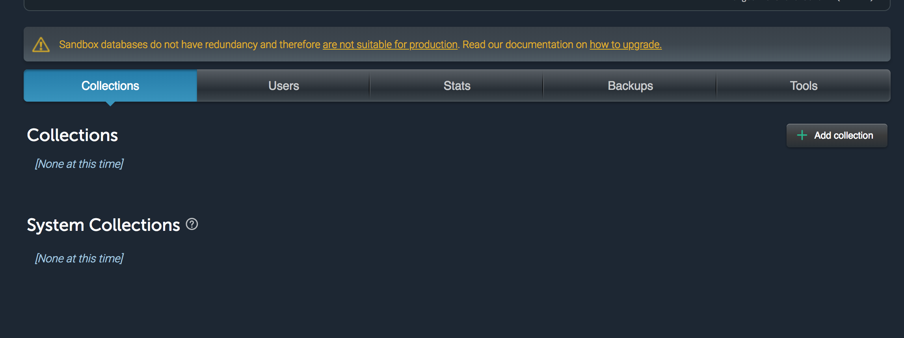

---
## MongoDB with jupyter

---
## connect
```python
from pymongo import MongoClient
client = MongoClient("mongodb://..")
client.{DBName}.collection_names()
```


---
## Assign DB, Collection
```python
db = client.{DBName}
new_collection = db.{CollectionName}

or

db = client[{DBName}]
new_collection = db[{CollectionName}]
```


---
## INSERT data
```python
some_user = {
	"name":"Fastcampus",
    "email":"help@fastcampus.co.kr",
}
new_collection.insert_one(some_user)
```


---
## SELECT
```python
new_collection.find_one()

or

query = {}
new_collection.find_one(query)
```


---
## SELECT all data
```python
query = {}
cursor = new_collection.find(query)
[item for item in cursor]
```


---
## SELECT * WHERE name = "fastcampus"
```python
query = {"name":"fastcampus"}
new_collection.find_one(query)
```


---
## INSERT lots of data in one time
```python
data_list = [
	{
    	"name":"jyp",
        "email":"jyp@fastcampus.co.kr",
    },
    {
    	"name":"gd",
        "email":"gd@fastcampus.co.kr",
    },
]

new_collection.insert_many(data_list)
```


---
## WHERE in ("jyp", "gd")
```python
query = {
	"name":{
    	"$in": ["jyp", "gd"]
        }
}
new_collection.find(query)
```


---
## AND, OR
```python
query = {
	"name":"jyp",
    "email":"jyp@fastcampus.co.kr",
}
new_collection.find(query)
```
```python
query = {
	$or:[
    	{"name":"jyp"}, 
        {"email":"gd@fastcampus.co.kr"},
    ]
}
new_collection.find(query)
```

---
### Operator
`{field:{<operator>:<value>}}`
|Operator|NoSQL|
|:--:|:--:|
|=|$eq|
|!=|$ne|
|>|$gt|
|>=|$gte|
|<|$lt|
|<=|$lte|
|IN|$in|
|NOT IN|$nin|

---
### COUNT(*)
```python
new_collection.count()
```

---
## GROUP BY
```python
# like temporary table
cursor = collection.aggregate([
	{
    	"$group":{condition}
    }
])
```

---
## pymongo with requests

---
### import requests
```
import requests

url = ""
headers = {}

response = requests.get(url, headers=headers)
```

---
### json decode
```
item_list = response.json()["items"]
```

### insert lots of data
```python
item_list.insert_many(item_list)
```

---
## MongoDB with Educational information

---
## MongoDB with Real Estate


---
<link href="https://fonts.googleapis.com/css?family=Nanum+Gothic:400,800" rel="stylesheet">
<link rel='stylesheet' href='//cdn.jsdelivr.net/npm/hack-font@3.3.0/build/web/hack-subset.css'>

<style>
h1,h2,h3,h4,h5,h6,
p,li, dd {
font-family: 'Nanum Gothic', Gothic;
}
span, pre {
font-family: Hack, monospace;
}
</style>