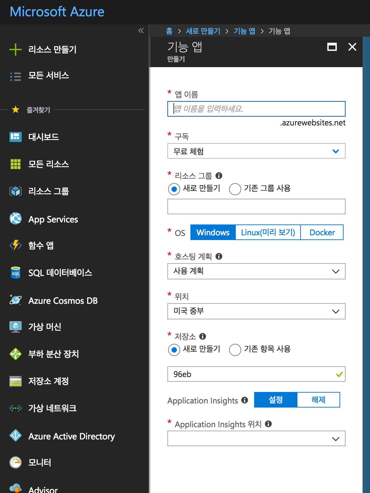
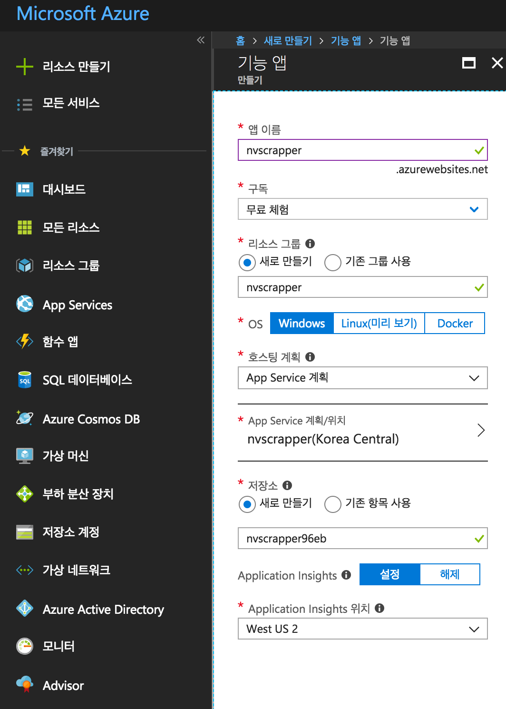
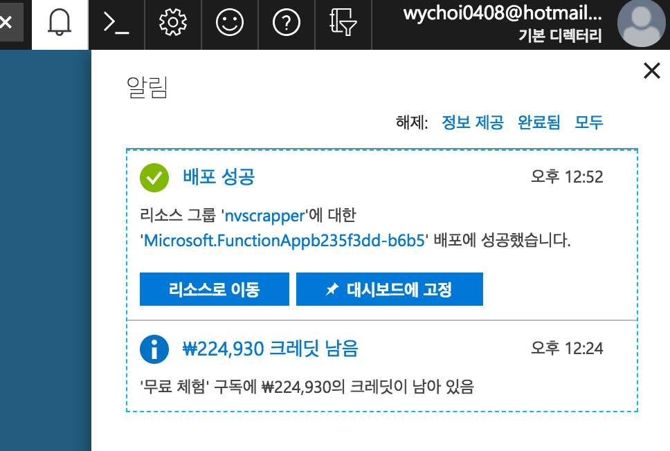
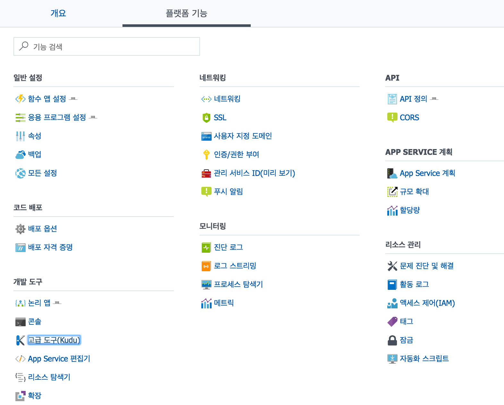
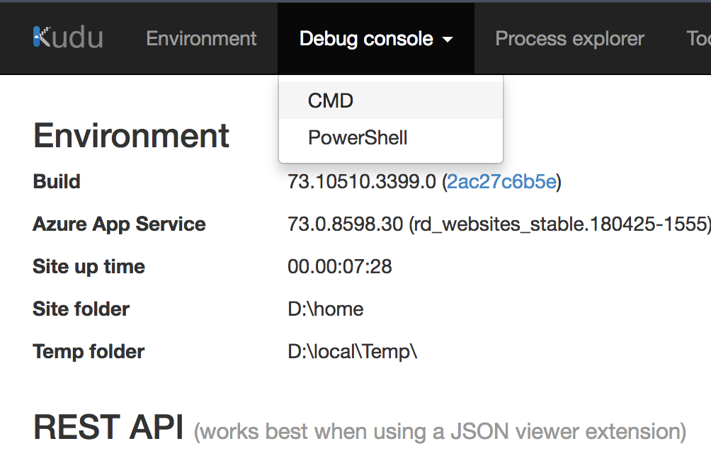
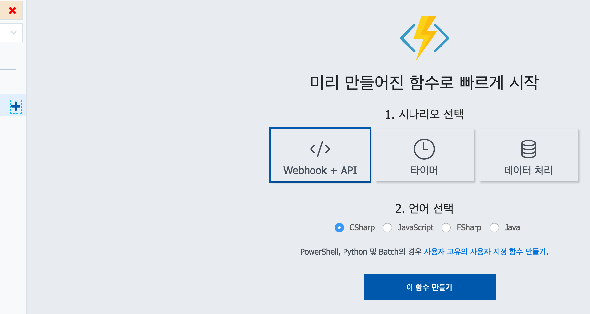
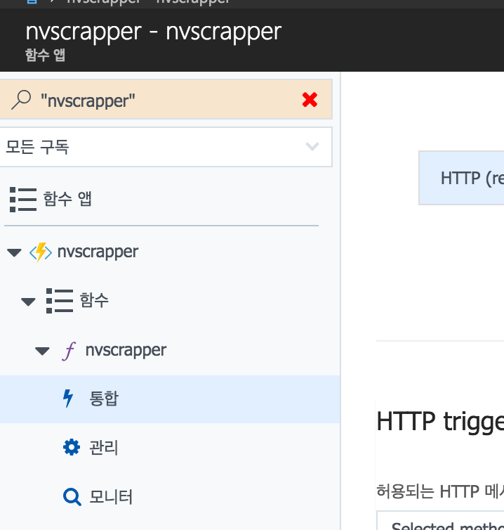
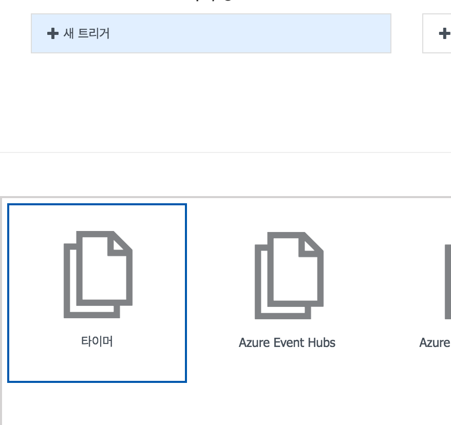
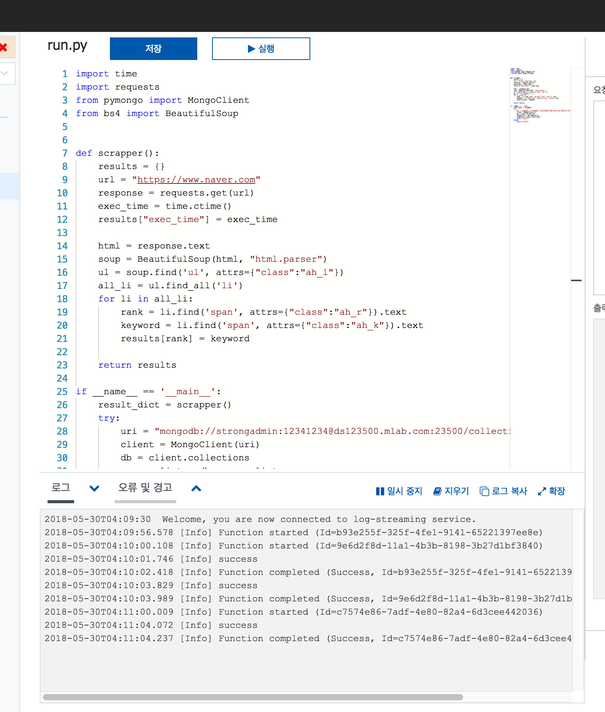

# Fastcampus Data Science Extension SCHOOL
## API Scraping & scheduling

---
<!--
page_number: true
$size: A4
footer : fastcampus 데이터 사이언스 Extension 스쿨, Wooyoung Choi, 2018
-->

## Requirements
- requests
- bs4
- pymongo
- credit card(visa or mastercard)

---
## API
- Application Programmable Interface


---
## How to get data from API

---
## [inspect] -> [Network]

### XHR
- XML HTTP Request

---
## test postman before requests.get()

---
## postman으로 테스트 하는 이유
- API에 독립으로 접근이 가능한지 알아보기 위해
- API에 독립으로 접근했을 때 필요로 하는 헤더값들을 알아보기 위해

---
## Let's get watcha news list

---
## naver realtime keywords with requests, bs4, pymongo
### Again!

---
## Scheduling Web Scraper

---
## 1. cron

`$ crontab file`

```
# Example of job definition:
# .---------------- minute (0 - 59)
# |  .------------- hour (0 - 23)
# |  |  .---------- day of month (1 - 31)
# |  |  |  .------- month (1 - 12) OR jan,feb,mar,apr ...
# |  |  |  |  .---- day of week (0 - 6) (Sunday=0 or 7) 
# |  |  |  |  |     OR sun,mon,tue,wed,thu,fri,sat
# *  *  *  *  * command
```

---
## examples
`0 * * * * /path/to/scraper.py`

`0,20,40 * * * * /path/to/scraper.py`

`*/1 * * * * /path/to/scraper.py`

`*/10 * * * * /path/to/scraper.py`

`* 9-18 * * * /path/to/scraper.py`

`30 * * * 1-5 /path/to/scraper.py`

`*/10 * * * 1-5 /path/to/scraper.py`

---
## Let's scheduling crawler with cloud

---
## Serverless application services
- Google cloud functions
	- only javascript yet..
- AWS Lambda
	- difficulty, durations..
- Microsoft Azure functions
	- easy! with GUI Only!

---
## We'll use Azure functions

---
## Create Account
https://azure.microsoft.com/ko-kr/

---
## new functions



---
## add storage(for scheduler)


---
## deploy success


---
## 고급도구(kudu)


---
## debug console -> cmd to install requirements


---
### install python3
`nuget.exe install -Source https://www.siteextensions.net/api/v2/ -OutputDirectory D:\home\site\tools python364x64
`

### mv python3 to azure env
`mv /d/home/site/tools/python364x64.3.6.4.2/content/python364x64/* /d/home/site/tools/
`

---
## install requests, bs4, pymongo via pip
`d:/home/site/tools/python -m pip install requests beautifulsoup4 pymongo`

---
## start with custom new function


---
## http trigger with python


---
## in integration


---
## delete existed trigger and add new trigger to schedule



---
## paste python script


---
<link href="https://fonts.googleapis.com/css?family=Nanum+Gothic:400,800" rel="stylesheet">
<link rel='stylesheet' href='//cdn.jsdelivr.net/npm/hack-font@3.3.0/build/web/hack-subset.css'>

<style>
h1,h2,h3,h4,h5,h6,
p,li, dd {
font-family: 'Nanum Gothic', Gothic;
}
span, pre {
font-family: Hack, monospace;
}
</style>