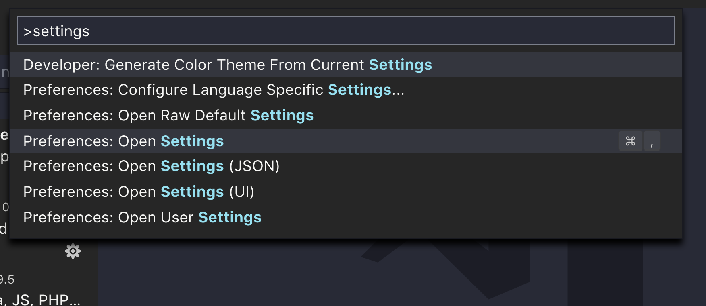
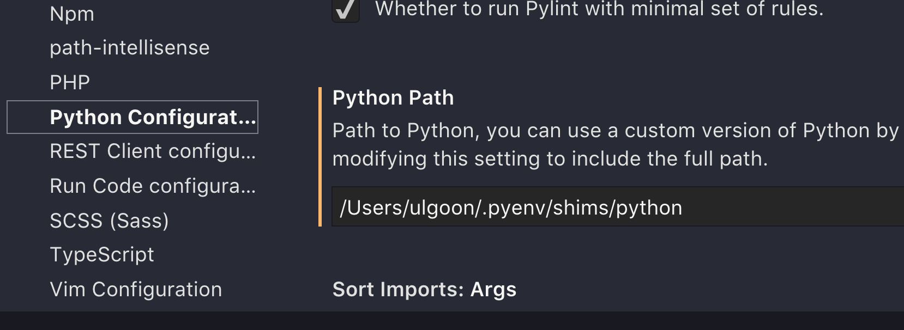
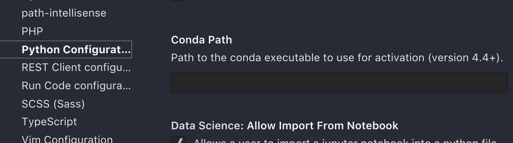
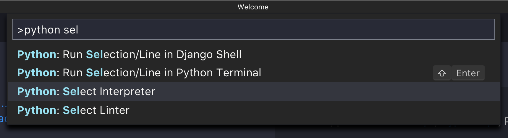
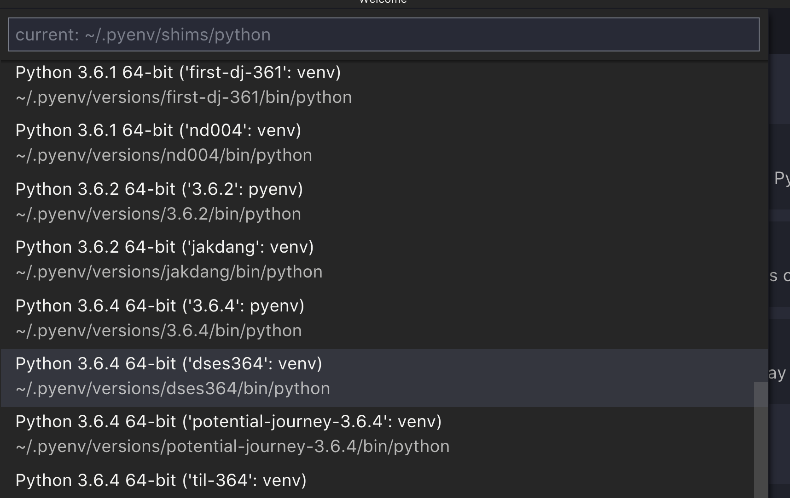
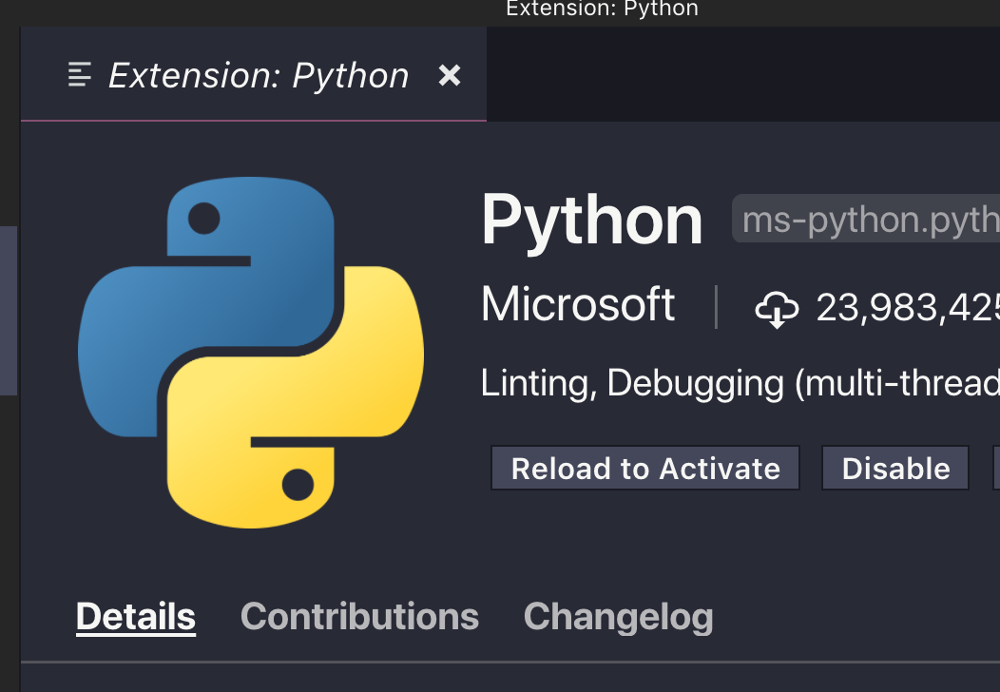

# Fastcampus Data Science Extension SCHOOL
## Regular Expressions

---
<!--
page_number: true
$size: A4
footer : fastcampus 데이터 사이언스 Extension 스쿨, Wooyoung Choi, 2018
-->

## Index

- work with vs code
- Review
- Regular Expressions

---
## Let's install VS  Code

https://code.visualstudio.com/

---
## install pylint
`sudo pip3 install pylint` for macOS, linux
`pip install pylint` for windows

---
## Set configuration


- `ctrl+shift+p` or `command+shift+p` > settings

---
## Set configuration for python


- windows는 powershell에서 `get-command python` 명령으로 구한 path를 붙여넣습니다.

---
## Set configuration for conda


---
## or select interpreter easily


---
## or select interpreter easily


---
## Install Extensions


---
## Install Extensions


---
## work with vs code

---
## Do it yourself!
임의의 숫자(1~1000 사이의 정수) `두 개`로 이루어진 100개의 `tuple`을 csv파일로 저장한 뒤, 
이를 불러와 `곱셈 연산을 수행`하여 새로운 파일에 두 수와 곱셈 결과를 다시 csv파일로 작성하는 파일을 작성하세요.
(단, 파일을 불러올 때 try except를 적용하여, FileNotFoundError가 발생했을시 에러메시지만 출력한 뒤, pass하세요.)

---
## Answer #1
```python
import random


with open('./random_nums.csv','w') as f:
    
    for _ in range(1,100+1):
        num1 = random.randint(1,1000+1)
        num2 = random.randint(1,1000+1)
        result = (num1, num2)
        f.write("{num1},{num2}\n".format(num1=num1, num2=num2))
        
with open('./random_nums.csv','r') as f:
    text = f.readlines()
    for item in text:
        print(text)
```

---
## Answer #2
```python
with open('./random_nums.csv', 'r') as f:
    items = []
    text = f.readlines()
    for s in text:
        items.append(
            int(t) for t in s.replace('\n','').split(','))
    
    try:
        file_name = input("Enter the filename
        	(Don't need to type extension): ")
        with open('./{file_name}.csv'.format(
            file_name=file_name
            ), 'w') as g:
            
            for num1,num2 in items:
                g.write("{num1},{num2},{result}\n".format(
                    num1=num1,
                    num2=num2,
                    result=num1*num2))
    except FileNotFoundError as e:
        print(e)
```

---
## Regular Expressions

---
## Regular Expressions

- 특정한 규칙을 가진 문자열의 집합을 표현하는데 사용하는 형식언어
- Python은 re 모듈로 정규표현식 사용 가능
- 기본적인 문법은 비슷하나 언어별로 사용법이나 문법이 조금씩 달라 외우기 보다는 필요할 때 [Reference](https://docs.python.org/3/howto/regex.html)를 참조하는 것이 낫습니다.

---
## Regular Expressions - match()
```python
import re
a = 'penpineapple'
b = 'applepen'

m = re.match('^pen', a)
n = re.match('^pen', b)

>>> m
<_sre.SRE_Match object; span=(0, 3), match='pen'>
>>> n
None
```

---
## Regular Expressions - match object

```python
>>> m.group()
'pen'
>>> m.start()
0
>>> m.end()
3
>>> m.span()
(0,3)

>>> a[m.start():m.end()]
'pen'
```

---
## Regular Expressions - Meta Characters

-	Dot(`.`): 개행문자(\n)을 제외한 모든 문자를 의미합니다.
ex) a.ple == a(모든문자)ple == aaple, abple, acple, ..
-	Repetition(`*`): 앞 문자의 반복을 의미합니다.(0개 ~ 무한대)
ex) ap*le == ale, aple, apple, appple, ..
-	Repetition(`+`): 앞 문자의 반복을 의미합니다.(1개 ~ 무한대)
ex) ap+le == aple, apple, appple, ..
-	Caret(`^`): 정의한 문자열 패턴으로 시작함을 의미합니다.
ex) ^pen == penpineapple (!= applepen)
-	Dollar sign(`$`): 정의한 문자열 패턴으로 끝남을 의미합니다.
ex) [a-z]+pen$ == applepen (!= penpineapple)


---
## Regular Expressions - Meta Characters


-	Question mark(`?`): 앞 문자의 존재유무(있거나 없거나)를 의미합니다.
ex) appl?e == appe 또는 apple
-	Curly brackets(`{m,n}`): 반복횟수를 정의할 때 사용합니다. 중괄호 안의 숫자(m,n)은 반복횟수를 정의하며, 정확히 일치할 경우 1개의 숫자(m)를, 범위를 정의할 경우 2개의 숫자를 사용합니다.(m개~n개)
ex1) ba(na){2} == banana
ex2) ba(na){0,2} == ba, bana, banana

---
## Regular Expressions - Meta Characters

-	Square brackets(`[]`): 문자클래스를 의미합니다. 대괄호 사이에 나열한 문자 중 하나의 값과 일치할 경우를 의미합니다. 이 문자클래스와 함께 쓰이는 메타문자는 하이픈(-) 과 캐럿(^) 입니다.
	- Hyphen(-): 두 문자 사이의 범위를 뜻합니다.
ex1) [A-Za-z] == 대문자와 소문자 알파벳 모두
ex2) [a-g0-5] == a,b,c,d,e,f,g 와 0,1,2,3,4,5 중 하나의 문자
	- Caret(^): 부정(Not)을 의미합니다.
ex1) [^0-9]: 숫자가 아닌 문자
ex2) [^A-Za-z]: 알파벳이 아닌 모든 문자


---
## Regular Expressions - Meta Characters

-	Parentheses(`()`): 소괄호 안의 문자열의 그룹을 의미합니다. 문자열 패턴의 반복을 검사하고 싶을 때 사용합니다.
ex) (apple)+ == penpineappleapplepen

-	Vertical bar(`|`): | 의 좌우 중 하나의 값과 일치하는 경우를 의미합니다. 
ex1) (apple|apqle) == apple 또는 apqle
ex2) ap[p|q]le == apple 또는 apqle
-	Backslach(`\`): 정규표현식을 만들 때 메타문자가 메타문자가 아닌 그 문자 그대로 사용하게 하기 위해 사용합니다.
ex) `https://www.google.co.kr/`=> URL의 구두점(.)이 메타문자로 인식될 수 있음
-> `https://www\.google\.co\.kr/`

---
## Regular Expressions - HOW TO USE?

```python
>>> p = re.compile('^pen')
>>> m = p.match(a)
>>> m
<_sre.SRE_Match object; span=(0, 3), match='pen'>

>>> m.group()
'pen'
```

- compile을 해두면 regular expression object를 재사용 할 수 있어 훨씬 효율적으로 운영할 수 있습니다.

---
## re module functions
```python
re.search(patterns, string[, flags])
re.match(patterns, string[, flags])
re.findall(patterns, string[, flags])
re.compile(pattern[, flags])
re.split(patterns, string[,maxsplit=0])
re.sub(pattern, repl, string[, count])
```


---
## Regular Expressions - Extract text
`fake_info.csv`를 읽어 결과물을 리스트에 저장한 뒤, 정규표현식을 활용하여 다음 문제를 해결하세요.(str.split(',')을 사용하지 말 것)
`name,email,age,state`

1. 유저의 평균 나이를 조사하세요.
2. 이메일 도메인의 분포를 조사하세요.
2-1. 도메인 점유율
2-2. com과 net의 비율

3. 주거 주(state) 분포를 조사하세요.(주거 주의 리스트와 인원 수)

---
## Regular Expressions - with Hangul

`ㄱ-ㅎ`
`ㅏ-ㅣ`
`가-힣`

---
## Regular Expressions - with Hangul

다음 문자열 `이름:김패캠 전화번호:010-이삼사오-6789 사는곳:서울강동구 이메일:facampkim@gmail.com` 에서 이름과 전화번호, 사는곳, 이메일을 정규표현식을 활용해 추출하세요.

다음에 대해서도 동작하도록 구성하세요
`이름:박패캠 전화번호:OIO-2345-육칠팔구 사는곳:부산광역시 이메일:facamppark at gmail dot com`

<link href="https://fonts.googleapis.com/css?family=Nanum+Gothic:400,800" rel="stylesheet">
<link rel='stylesheet' href='//cdn.jsdelivr.net/npm/hack-font@3.3.0/build/web/hack-subset.css'>

<style>
h1,h2,h3,h4,h5,h6,
p,li, dd {
font-family: 'Nanum Gothic', Gothic;
}
span, pre {
font-family: Hack, monospace;
}
</style>