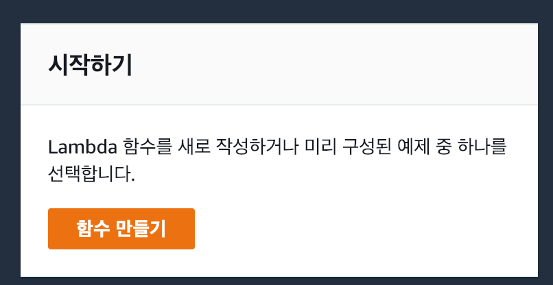
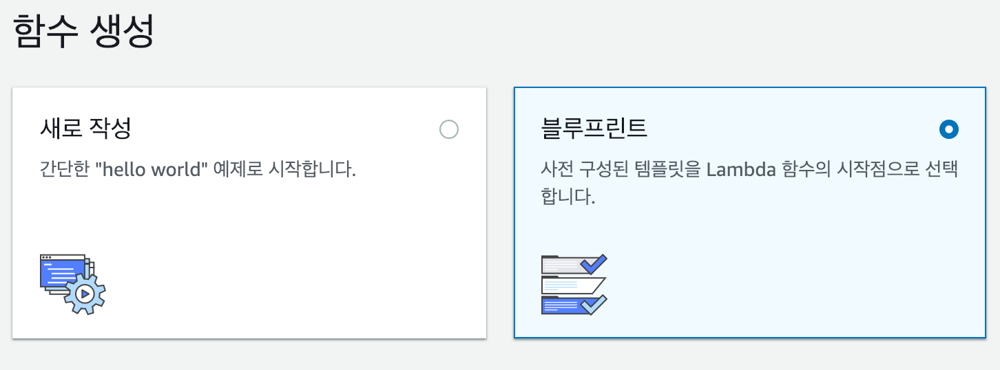
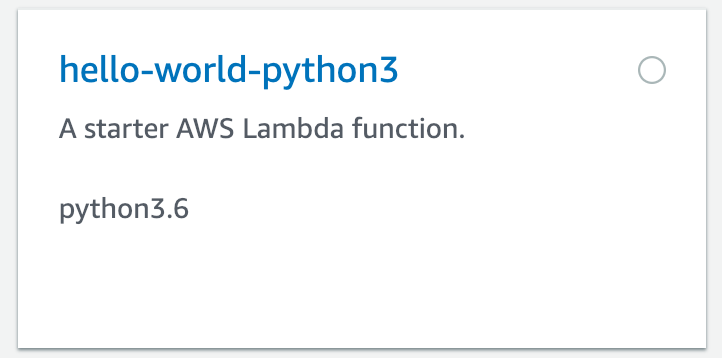
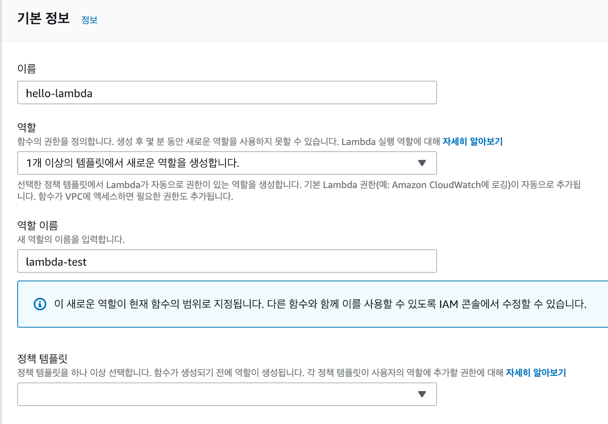
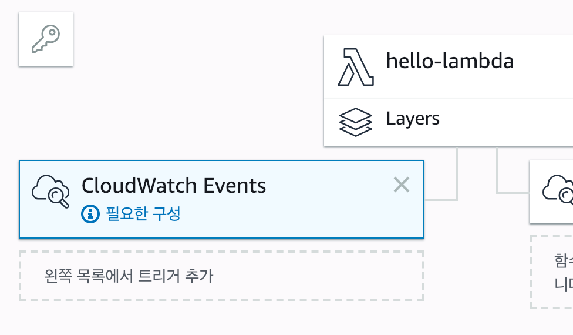
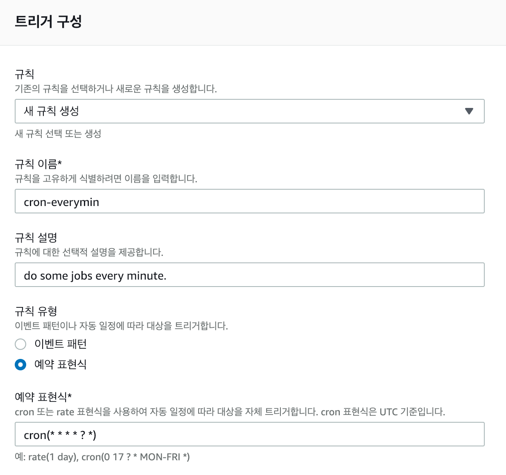
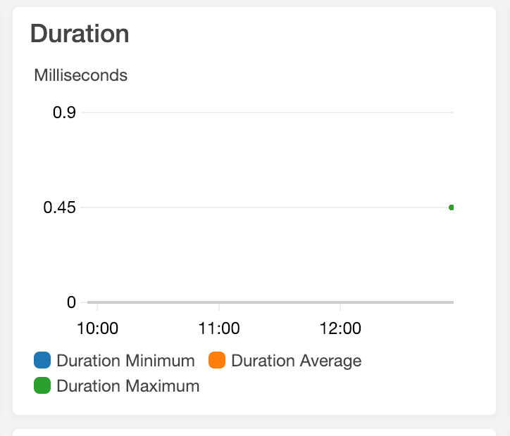
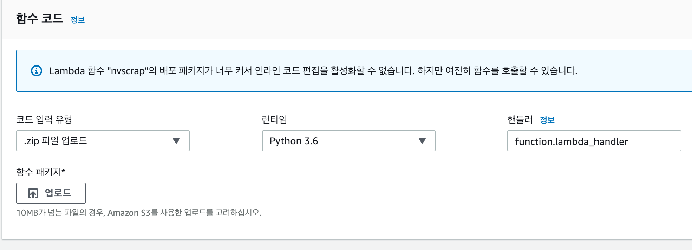

# Fastcampus Data Science Extension SCHOOL
## Cloud Service - AWS Lambda, EC2

---
<!--
page_number: true
$size: A4
footer : fastcampus 데이터 사이언스 Extension 스쿨, Wooyoung Choi, 2018-2019
-->

## Index
- Introduce to Cloud Computing
- AWS Lambda
- AWS EC2

---
## Cloud Computing
- 인터넷에 연결된 다른 컴퓨터로 연산을 하는 기술
- 접근성, 주문형 서비스 제공으로 경제적이고 효율적인 컴퓨팅 서비스 제공
- Amazon Web Service(Amazon), Google Cloud Platform(Google), Microsoft Azure(Microsoft), ..
- Virtual Machine, Cloud Storage, Database, Docker Engine 등 다양한 서비스 제공

---
## AWS


- 2006년 Amazon이 시작한 클라우드 컴퓨팅 서비스
- 전세계 20개의 Region, 60개의 Zone을 제공

---
## Lambda


- http://aws.amazon.com/lambda

---
## AWS Lambda
- Event-driven, serverless computing platform
- Cloud function(GCP), Azure function(MS Azure)

---
## Lambda can..
- serverless API
- preprocessing
- authorizer
- auto-scaling
- ..

---
## Hello world with Lambda

---
## New lambda function


---
## New lambda function


---
## New lambda function


---
## New lambda function


---
## New lambda function


---
## New lambda function


---
## Schedule with cron
- cron: Unix-like 시스템에서 어떤 일을 주기적으로 실행시키기 위해 사용하는 툴

---
## cron

`$ crontab file`

```
# Example of job definition:
# .---------------- minute (0 - 59)
# |  .------------- hour (0 - 23)
# |  |  .---------- day of month (1 - 31)
# |  |  |  .------- month (1 - 12) OR jan,feb,mar,apr ...
# |  |  |  |  .---- day of week (0 - 6) (Sunday=0 or 7) 
# |  |  |  |  |     OR sun,mon,tue,wed,thu,fri,sat
# *  *  *  *  * command
```

---
## examples
`0 * * * * /path/to/scraper.py`

`0,20,40 * * * * /path/to/scraper.py`

`*/20 * * * * /path/to/scraper.py`

`*/10 * * * * /path/to/scraper.py`

`* 9-18 * * * /path/to/scraper.py`

`30 * * * 1-5 /path/to/scraper.py`

`*/10 * * * 1-5 /path/to/scraper.py`

---
## in AWS Lambda

```
# Example of job definition:
# .---------------- minute (0 - 59)
# |  .------------- hour (0 - 23)
# |  |  .---------- day of month (1 - 31)
# |  |  |  .------- month (1 - 12) OR jan,feb,mar,apr ...
# |  |  |  |  .---- day of week (0 - 6) (Sunday=0 or 7) 
# |  |  |  |  |     OR sun,mon,tue,wed,thu,fri,sat
# |  |  |  |  |  .- year (1970-2199)
# |  |  |  |  |  |
# *  *  *  *  *  * 
```

(https://docs.aws.amazon.com/ko_kr/AmazonCloudWatch/latest/events/ScheduledEvents.html#RateExpressions)

---
## Wildcard
- `,`: 값을 나열
- `-`: 범위
- `*`: 모든
- `/`: 간격
- `L`: 마지막 (day, day of week only)
- `W`: 평일 (day only)

**warning**
1. 월과 요일은 *를 연속으로 사용할 수 없음 
(`* * * * ? *`==`* * * * * *`)
2. 최소 간격은 1분(* * * * ? *)


---
## New lambda function


---
## New lambda function



---
## schedule scraping with Cloud watch events


---
## schedule scraping with Cloud watch events


---
## Do it yourself
- function.zip의 압축을 풀어 function.py에 대하여 지난시간 활성화한 mlab database에 검색어를 저장하도록 하는 코드를 완성하세요
`pymongo`는 requirements에 존재합니다.

---
## EC2


- https://aws.amazon.com/ec2/

---
## AWS EC2
- Amazon Elastic Computer Cloud
- rent virtual computers
- Google Compute Engine, Azure Virtual Machines

---
## Install AWS CLI for windows
- 64bit: https://s3.amazonaws.com/aws-cli/AWSCLI64.msi
- 32bit: https://s3.amazonaws.com/aws-cli/AWSCLI32.msi

## windows10 built-in SSH
- https://www.howtogeek.com/336775/how-to-enable-and-use-windows-10s-built-in-ssh-commands/

---
## MacOS, Linux
`$ pip install awscli`
or
`$ pip3 install awscli`

---


---


---


---


----


---


---


---


---


---


---


`$ chmod 400 dses-ec2t4m.pem`


`$ ssh -i "dses-ec2t4m.pem" ubuntu@<your-public-domain>`

---


---

`$ wget https://repo.continuum.io/archive/Anaconda3-4.4.0-Linux-x86_64.sh`

`$ bash Anaconda3-4.4.0-Linux-x86_64.sh`

---

`$ vi ~/.bashrc`
`export PATH="/home/ec2-user/anaconda3/bin:$PATH"` <= add


---


---
`$ ipython`


copy **SHAstring!!!**

---
`$ jupyter notebook --generate-config`

`$ mkdir certs && cd certs`

---

`$ sudo openssl req -x509 -nodes -days 365 -newkey rsa:1024 -keyout mycert.pem -out mycert.pem`


---
`$ vi .jupyter/jupyter_notebook_config.py`

```python
c = get_config()

# Kernel config
c.IPKernelApp.pylab = 'inline'

# Notebook config
c.NotebookApp.certfile = u'/home/ubuntu/certs/mycert.pem' #location of your certificate file
c.NotebookApp.ip = '*'
c.NotebookApp.open_browser = False  
c.NotebookApp.password = u'sha1:...'  

c.NotebookApp.port = 8888
```

`:wq`

---
`$ mkdir dev/pynbs && cd dev/pynbs`
`$ jupyter notebook`

`https://<your-public-domain>:8888/`

---


<link href="https://fonts.googleapis.com/css?family=Nanum+Gothic:400,800" rel="stylesheet">
<link rel='stylesheet' href='//cdn.jsdelivr.net/npm/hack-font@3.3.0/build/web/hack-subset.css'>

<style>
h1,h2,h3,h4,h5,h6,
p,li, dd {
font-family: 'Nanum Gothic', Gothic;
}
span, pre {
font-family: Hack, monospace;
}
</style>